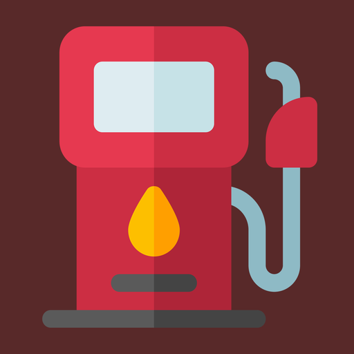
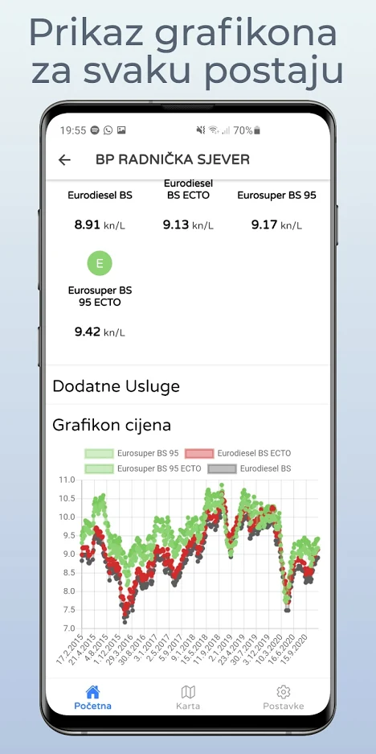
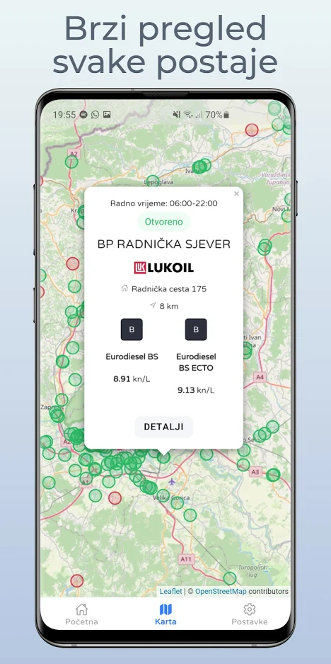
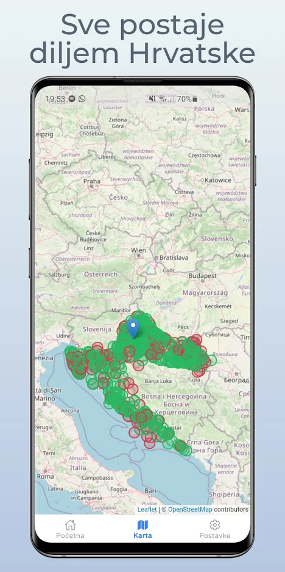

 
<h2 align="center"><b>Benzinske postaje</b></h2>
<h4 align="center">Hibridna aplikacija za prikazivanje cijene goriva</h4>

 <a href="https://play.google.com/store/apps/details?id=stjepan.com.benz" alt="Google play izdanje"> 

## Slike zaslona

## Opis
Aplikacija koristi [HAK](https://map.hak.hr/) stranicu za preuzimanje podataka, te aplikacija koristi vašu trenutnu lokaciju da pronađe benzinske postaje u blizini vas. Mogućnost traženja i filtiranje benzinskih postaji po: Udaljenosti, cijeni goriva, vrsta goriva i gradu.
